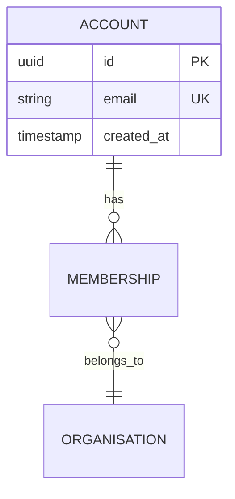
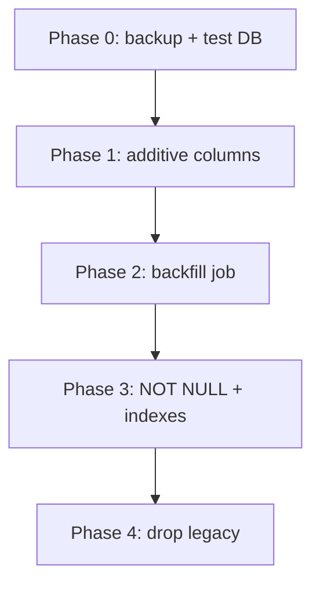
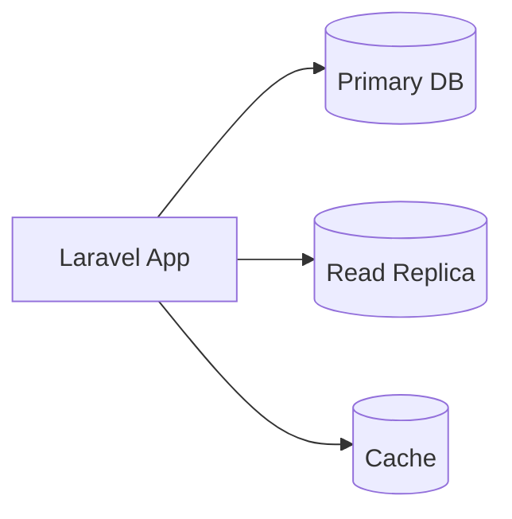
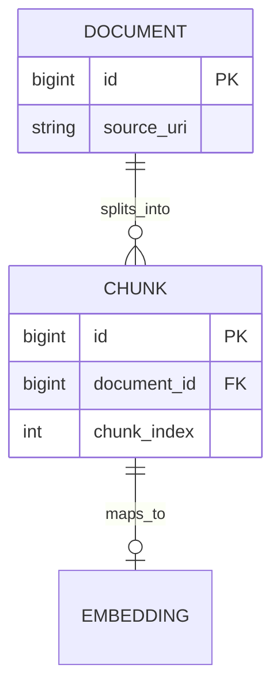

# Mermaid patterns for data-architect-expert

## ER diagram (core)

Cardinality: `||--||` one-one, `||--o{` one-many, `}o--o{` many-many (use junction entity in logical model).

## Migration phase flow

## Read replica / cache

## Vector + relational (RAG)

Delegate embedding store details to `/vector-database-expert`.