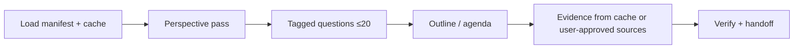

# Pattern: Perspective-Guided Discovery (on-demand)

**Not STORM.** Vocabulary and flow borrowed from multi-perspective questioning — no `knowledge-storm`, no web-first pipeline, no Co-STORM runtime. See `docs/reference/storm-inspired-patterns-plan.md`.

**Cache is king.** Load manifest + cache spine before any source read or web fetch.

## Purpose

Run a **fixed lens pass** (Developer, Operator, Security, Product/stakeholder) to produce better questions and outlines before investigation, documentation, or external research — instead of one flat “scan everything” prompt.

## When to use

| Scenario | Entry |
|----------|-------|
| Codebase onboarding / cache refresh | `/acquire-codebase-knowledge` (Phase 1.5) |
| Full human + agent docs site | `/documentation-specialist` (Phase 2.5) |
| Unfamiliar external topic before build | `/chain research-deep-dive` |
| Complex multi-domain plan needing framing | `/orchestrator` with `discovery_mode: true` |

## When not to use

- Bug fixes, migrations, routine CRUD, or a named file path the user already gave
- Scheduled loops (L1 daily triage does **not** auto-run this)
- Default session entry (`/chain session-start` stays cache + standup only)
- Replacing domain skills (PayPal, SES, Laravel, etc.) — discovery **frames**; specialists **implement**

## Flow

| Step | Output | STORM role mapped |
|------|--------|-------------------|
| Load cache | Cited spine files | Shared conceptual space (`STATE.md`, `docs/codebase/`) |
| Perspective pass | ≤20 tagged questions | Moderator probing |
| Outline / memo skeleton | Section list or research frame | Outline-first populate |
| Evidence | Cache, pasted sources, approved web only | Domain experts (skills) |
| Verify | Acceptance criteria, `loop-verifier` / `check-work` | Verifier |
| Handoff | `/orchestrator`, domain skill, or doc layer | Human steering + merge gates |

### Question tags

- `answerable-from-cache` — resolve in frame; no source read
- `needs-source-read` — after user confirms direction
- `needs-user-source` / `needs-web-approved` — research-deep-dive gather only with explicit approval
- `[ASK USER]` — block until answered

## Discourse mapping (orchestrator)

| STORM / Co-STORM role | Orchestrator equivalent |
|----------------------|-------------------------|
| Moderator | `orchestrator` `merge_gates` + `contract_check` |
| Domain experts | Specialist skills / Task subagents (lanes) |
| Human steering | Chain opt-out, `agent_policy` approval gates |
| Shared space | `STATE.md` + `docs/codebase/` cache spine |
| Turn-based steps | Chain steps + handoff JSON (≤80 tokens) |
| Verifier | `loop-verifier`, `check-work` |

## Skills and chains

| Artifact | Path |
|----------|------|
| Lenses reference | `.grok/skills/acquire-codebase-knowledge/references/perspective-lenses.md` |
| Acquire Phase 1.5 | `.grok/skills/acquire-codebase-knowledge/SKILL.md` |
| Doc outline Phase 2.5 | `.grok/skills/documentation-specialist/SKILL.md` |
| External research | `.grok/skills/research-deep-dive/SKILL.md`, `/chain research-deep-dive` |
| Orchestrator hint | `.claude/agents/orchestrator.md` — `discovery_mode` |

## Loop policy

- **L1** loops remain report-only; this pattern is **on-demand**, not scheduled.
- Daily triage does **not** auto-run research or perspective pass.
- **L2+** (future): `research-deep-dive` memo may feed `STATE.md` — gated by `loop_policy.allow_l2: false` today.

## Required guardrails (Plan 3)

Every artifact using this pattern must:

1. **Cache citation** in the first substantive step
2. **Manifest-first** path reads
3. **Chain audit** after `chains/registry.yaml` edits
4. **Content policy** — no secrets or trade secrets in memos/docs
5. **Opt-out** — document single-skill path (`/research-deep-dive frame` without chain)

### Non-goals (never add without explicit user approval)

| Forbidden | Reason |
|-----------|--------|
| `pip install knowledge-storm` / STORM repo | Web-first; wrong product |
| DSPy pipeline | New framework; dep + token cost |
| Default Bing/Tavily/Serper retrieval | Violates cache-first |
| Viral copy-paste Claude prompts | Duplicates skills; no audit trail |
| Wikipedia-length auto-articles | Wrong output shape |
| STORM/Co-STORM branding in user-facing docs | Misleading naming |

## Outputs

| Skill / chain | Typical output |
|---------------|----------------|
| acquire-codebase-knowledge | `reports/codebase/.perspective-pass.md` (optional) + investigation agenda |
| documentation-specialist | `docs/index.md` section outline before page writes |
| research-deep-dive | `reports/research/<slug>-YYYY-MM-DD.md` |

## Acceptance

- [ ] Perspective pass runs before optional source read (≤20 questions)
- [ ] No new scheduled workflows
- [ ] `bash scripts/chain-audit.sh` and `bash scripts/loop-audit.sh` pass after registry edits