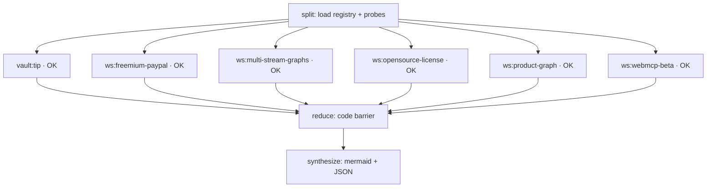

# Agent graph example — workstream diamond

Generated: `2026-07-25T07:51:57.302701+00:00` · HEAD `a555310`

## Topology



## Reduce (edge, free tokens)

```json
{
  "total_nodes": 6,
  "ok": 6,
  "failed": 0,
  "workstreams": 5,
  "by_status": {
    "held": 1,
    "active": 1,
    "held_ready": 1,
    "parked": 2
  },
  "failed_ids": []
}
```

## Nodes

| Node | Type | OK | Detail |
|------|------|----|--------|
| `vault:tip` | vault | True | ec3d8b02b6cdc650 |
| `ws:freemium-paypal` | workstream | True | held |
| `ws:multi-stream-graphs` | workstream | True | active |
| `ws:opensource-license` | workstream | True | held_ready |
| `ws:product-graph` | workstream | True | parked |
| `ws:webmcp-beta` | workstream | True | parked |

## How to re-run

```text
/multi-workstream list
/multi-workstream example
```

Diamond probes **workstream registry + vault tip only** — not product demos.
See plan: `docs/internal/MULTI-WORKSTREAM-SESSION-V2-PLAN.md`
